# 容器型主机中搭建vpn

## 前言
容器型的主机是相对于传统的虚拟主机而言的,一般来说阿里云,腾讯云等都是基于Hyper-V技术的虚拟机,而基于容器(Docker)的虚拟主机是最近一两年才出现的,
容器型的主机速度更快,资源利用率更高,管理也更方便.容器型主机通常不提供公网的IP地址,这样就会节约很多成本,本教程将讲述如何在容器型主机上搭建openvpn+squid服务.
vpn可以用来搭建属于用户的虚拟私有网络,在办公,游戏加速等领域有广泛的运用场景. 当然大家也可以用其他组件搭建vpn. 本文主要以ghostcloud.cn(精灵云)为案例进行讲解.


## 安装步骤详解

本教程主要包含几个部分: 安装并配置openvpn, 安装并配置squid, 启动脚本配置.

### 1 环境准备

云平台: ghostcloud.cn


操作系统: CentOS 7


主机类型: 微小型 1核 512MB 20GB硬盘 25+25GB流量

### 2 进入云平台
登陆ghostcloud.cn主页,然后进入控制台,选择新建容器微主机:
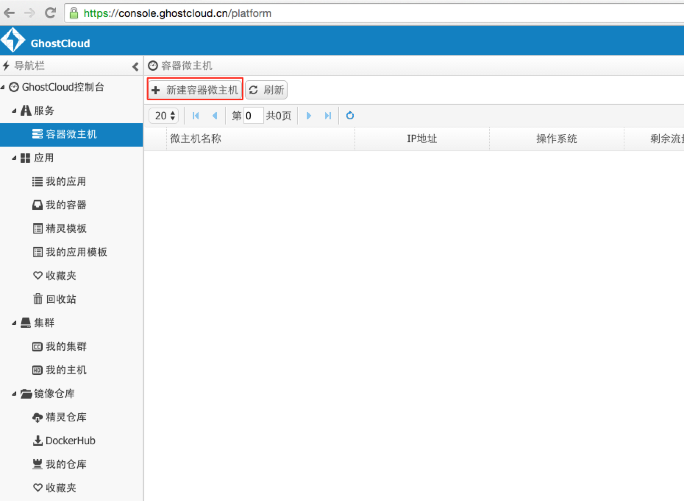

### 3 选型
选择centos 7; 具体型号根据需求选择, vpn对内存和带宽的需求比较大,需要针对实际情况选择; 最后主机ssh密码处填入初始密码.
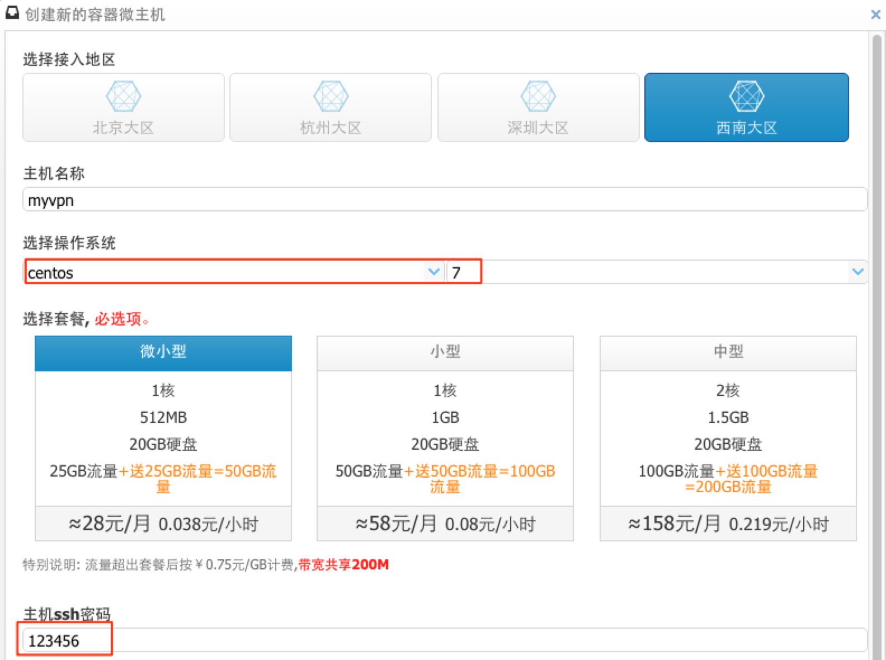

### 4 添加导出端口
接下来是最容易出错的地方,我们需要预先添加容器需要使用的端口. 容器本身并没有公网IP,要从公网访问容器就只能通过"公网IP:公网端口" -> "容器IP:容器端口",
这就是我们经常使用的NAT方式. 而这一步需要设置的也就是容器内部需要使用的端口.在这里,我们有4个端口是要导出到公网访问的,分别是:


a. 22 - 容器的ssh端口, 用于远程登陆到容器, 平台默认添加


b. 3389 - openvpn使用的端口, 用于vpn服务


c. 8080 - squid 缓存服务器端口, 用于加速上网


d. 80 - 容器的web服务器端口, 用于搭建文件服务器
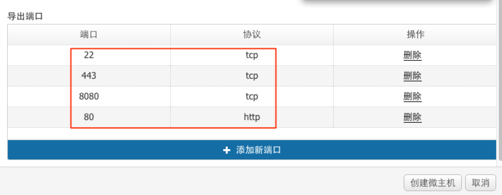

### 5 进入容器
创建成功后, 我们可以通过网页控制台和ssh方式进入系统. 网页控制台不需要第三方工具即可进入,ssh登陆需要用诸如putty和xshell的工具, 进入的时候注意端口一定要修改为主机的端口,
而不是22端口.
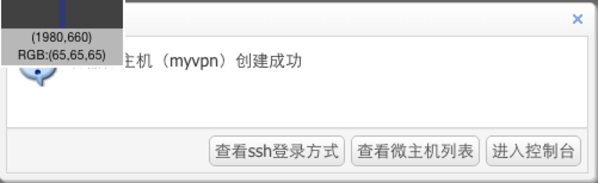

查看主机导出端口:
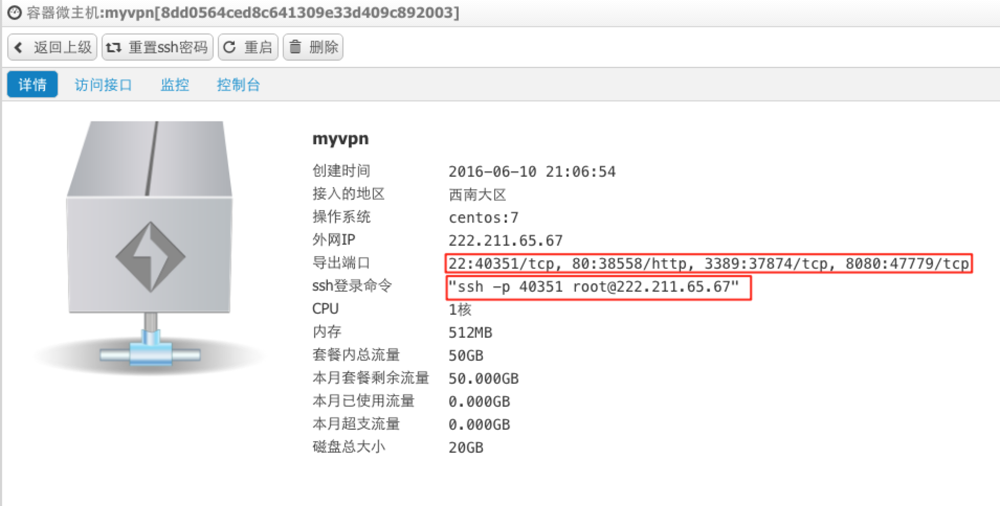
注意: 我们后续都只使用后面的外部端口.

### 正式安装
我们可以直接在网页中进入控制台模式:
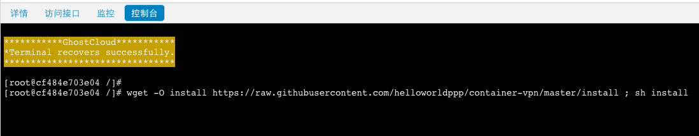

#### 一键安装脚本
可以直接在网页终端执行该命令进行安装
```
wget -O install https://raw.githubusercontent.com/helloworldppp/container-vpn/master/install ; sh install
```
注意: 由于代码是在国外,失败的话重复执行

如果你喜欢xshell或者putty, 也可以通过putty登陆, putty下载地址: https://the.earth.li/~sgtatham/putty/latest/x86/putty.exe
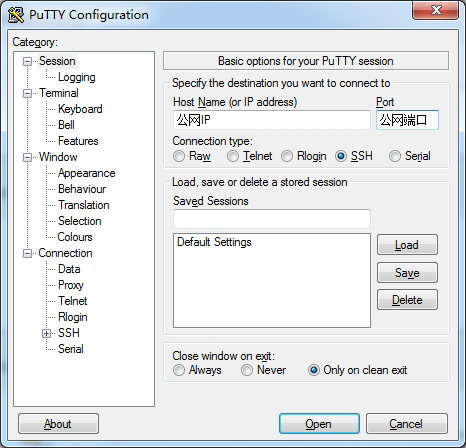
然后执行一键安装脚本.

## ovpn文件处理

### 1 下载并修改ovpn文件
安装成功后, 界面会有"Service Started. Download ovpn from:" , 还有一行是下载地址 (下图是我后续的截图,所以地址有点不一样, 具体参考你的实际地址):
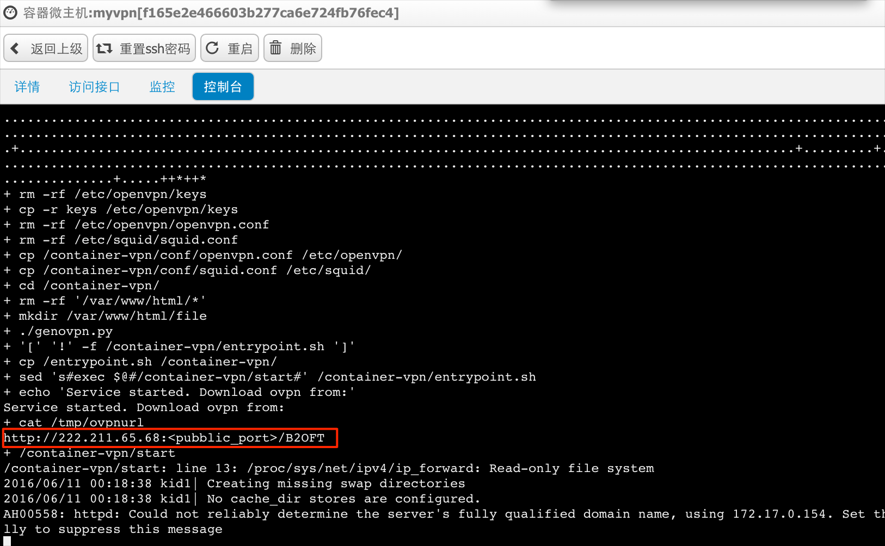
"http://222.211.65.67:<public_port>/H0MLY" 中的<public_port>需要替换为80端口对应的外部端口
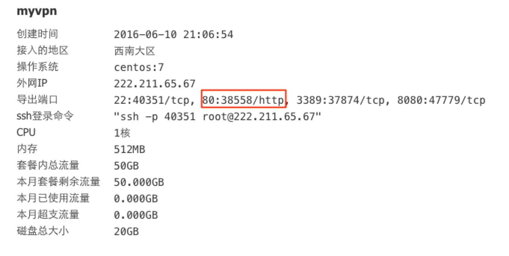
在这里替换为"http://222.211.65.67:38558/H0MLY"
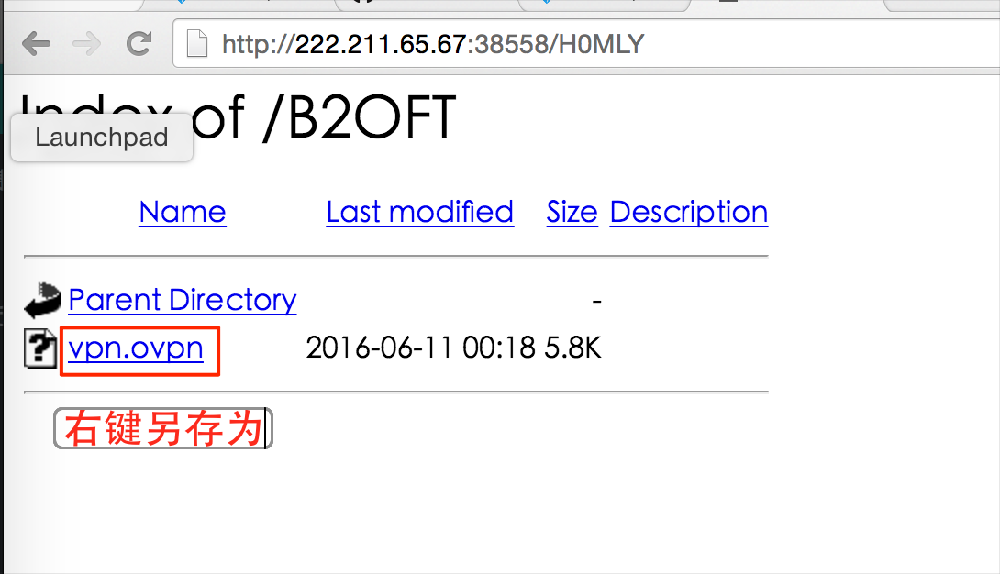


如果忘记了,可以ssh到主机然后执行:
```
cat /tmp/ovpnurl
http://222.211.65.67:<public_port>/H0MLY
```

### 2 修改文件
ovpn模板里面端口需要修改:
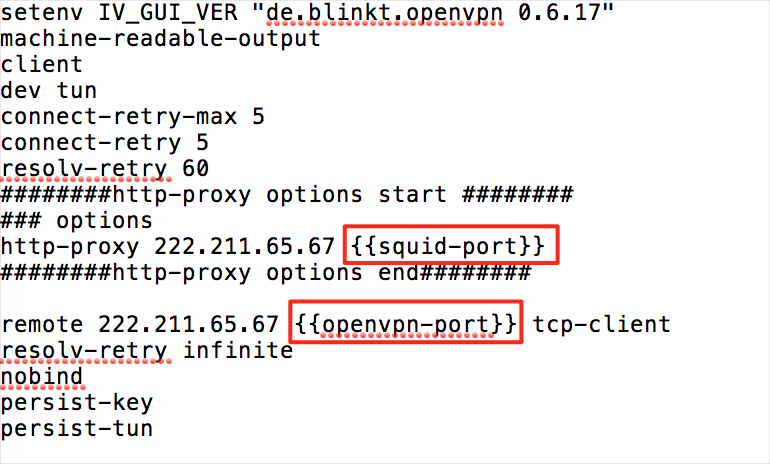

文件中的 {{squid-port}} 需要更改为8080对应的外部端口, 在本例中, 我们使用 47779端口
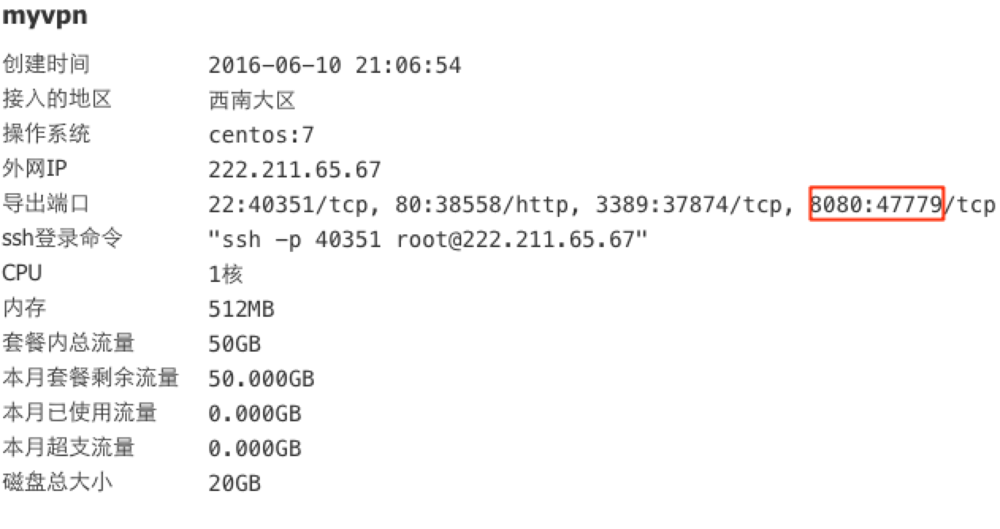

文件中的 {{openvpn-port}} 需要更改为3389对应的外部端口. 在本例中, 我们使用37874端口
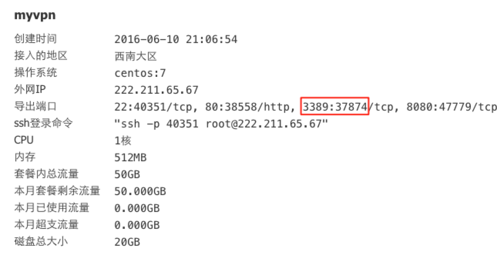

## 如何修改squid和openvpn配置文件
进入/etc/openvpn 修改 openvpn.conf

进入/etc/squid 修改 squid.conf

然后重启主机.


## 手动安装步骤
这部分给需要了解详细步骤的同学学习:

### 1 更换yum源
CentOS 7 系统默认的源很慢,更改为阿里源
```
cd /etc/yum.repos.d
mv CentOS-Base.repo CentOS-Base.repo.bak
wget -O /etc/yum.repos.d/CentOS-Base.repo http://mirrors.aliyun.com/repo/Centos-7.repo
yum makecache
```

### 2 安装openvpn和squid
整个过程持续1分钟左右:
```
yum install -y wget squid openssl openssl-devel lzo lzo-devel pam pam-devel automake pkgconfig openvpn git httpd
```

### 3 生成证书
进入container-vpn/easy-rsa, 执行build-all

### 4 系统配置
```
rm -rf /etc/openvpn/openvpn.conf
rm -rf /etc/squid/squid.conf
cp /container-vpn/conf/openvpn.conf /etc/openvpn/
cp /container-vpn/conf/squid.conf /etc/squid/
```

### 5 生成ovpn模板
将ovpn文件直接放在内部http服务器里面
```
cd /container-vpn/
rm -rf /var/www/html/*
./genovpn.py
```

### 6 配置entrypoint.sh
entrypoint.sh是容器启动执行的命令,需要将启动脚本最后的"exec $@" 替换为 "/container-vpn/start"
```
/container-vpn/start
```
这条指令可以让主机重启后执行启动脚本, 可以解决主机因内存不足崩溃后不能再服务的问题.


## 常见错误
1. 下载地址打不开: 检查下载地址的端口是不是80的外部端口.
2. 如何获得下载地址: 返回容器型主机->选择主机->控制台->执行cat /tmp/ovpnurl